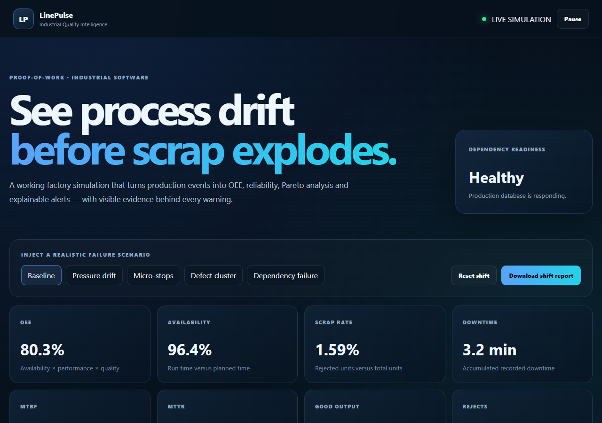

# LinePulse

**Industrial Quality & Reliability Intelligence**

LinePulse is a working proof-of-work project that simulates a production line and converts
its events into explainable quality, reliability and operational evidence.

It was designed around a simple position:

> A portfolio should not merely list technologies. It should demonstrate how engineering
> decisions change what an operator, quality technician or production manager can see.

## What the live system demonstrates

- Real-time synthetic production events
- OEE, availability, performance and quality
- Scrap rate, downtime, MTBF and MTTR
- Stop-reason and defect Pareto analysis
- Explainable alerts with evidence and recommended action
- Cutting-pressure drift scenario
- Repeated micro-stop scenario
- Concentrated defect scenario
- Simulated database dependency failure with readiness degradation
- Downloadable Excel shift report
- Health, readiness and Prometheus metrics endpoints
- Automated API, analytics and browser testing

## Screens and endpoints

| Evidence | Location |
|---|---|
| Operations dashboard | `/` |
| OpenAPI documentation | `/docs` |
| Health probe | `/health` |
| Readiness probe | `/ready` |
| Prometheus metrics | `/metrics` |
| JSON overview | `/api/overview` |
| Excel shift report | `/api/reports/shift.xlsx` |

## Run locally

```bash
python -m venv .venv
source .venv/bin/activate  # Windows: .venv\\Scripts\\activate
pip install -r requirements-dev.txt
uvicorn app.main:app --reload
```

Open `http://127.0.0.1:8000`.

Or use Docker:

```bash
docker compose up --build
```

## Test

```bash
python -m pytest
ruff check app tests
```

Browser QA:

```bash
cd qa
npm install
npx playwright install chromium
npm test
```

## Architecture and decisions

Read:

- [`docs/architecture.md`](docs/architecture.md)
- [`docs/proof-of-work.md`](docs/proof-of-work.md)

## Why this project exists

LinePulse combines software development with more than 20 years of practical production
experience. The scenarios are synthetic, but the operating questions are real:

- Are small stops silently destroying the shift?
- Is a process parameter drifting before defects become obvious?
- Is one defect dominating a machine/product combination?
- Can the service prove it is ready, not merely alive?
- Can every alert show the evidence behind it?

## Honest limitations

Version 0.1 is a synthetic MVP. It is not connected to a real PLC, MES or factory database,
and it does not claim production-scale predictive maintenance. Those boundaries are explicit
because credible engineering includes knowing what the evidence does not prove.

## Technology

Python · FastAPI · SQLAlchemy · SQLite/PostgreSQL-ready · Prometheus · OpenPyXL · Docker ·
Pytest · TypeScript · Playwright · GitHub Actions

## Inspect the implementation

- [KPI and alert calculations](app/analytics.py)
- [API and route-based metrics](app/main.py)
- [Analytics behaviour](tests/test_analytics.py)
- [API and metrics contracts](tests/test_api.py)

## Bounded monitoring labels

HTTP metric labels use matched route templates. Unknown URLs share the unmatched label, preventing each arbitrary URL from creating a new Prometheus time series.

## Operational boundaries

Events are synthetic. The simulator is process-local and this is a single-process demonstration, not a multi-worker production architecture.

## Actual application preview



[Watch the recorded demonstration and read the walkthrough](https://tefik-aliu.github.io/#demos). Captured from a local instance, with demonstration data.
